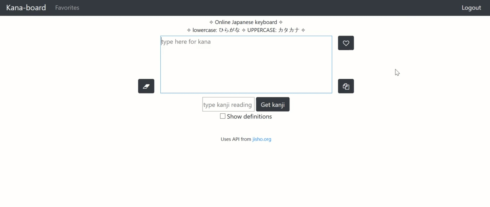
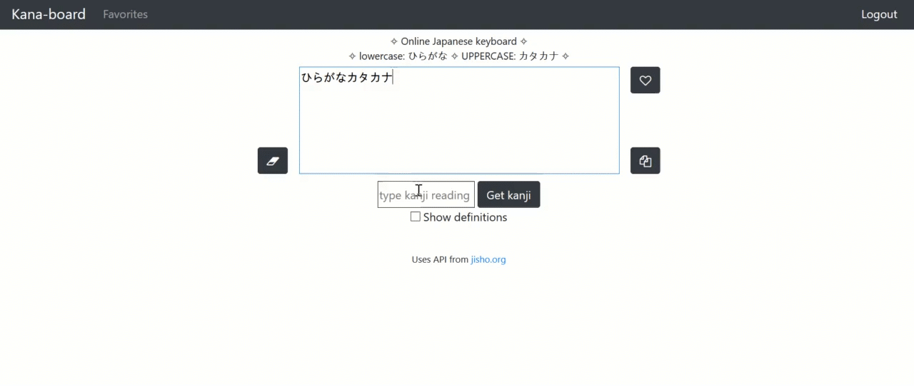
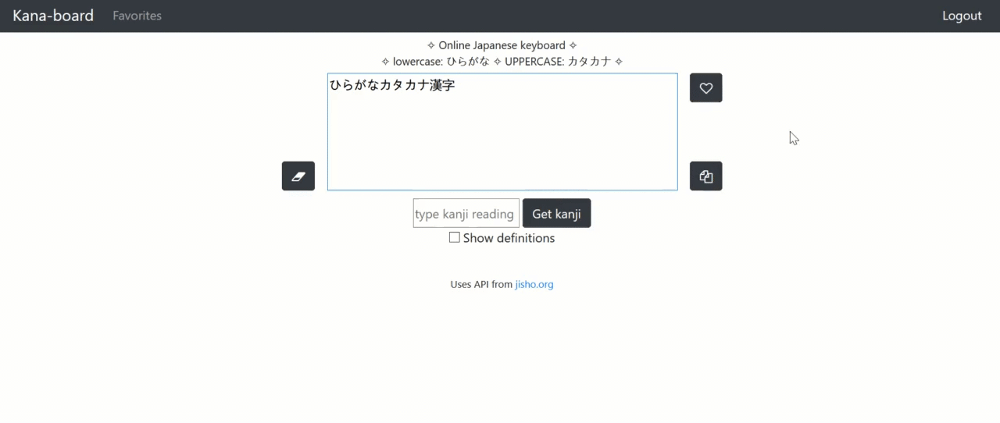
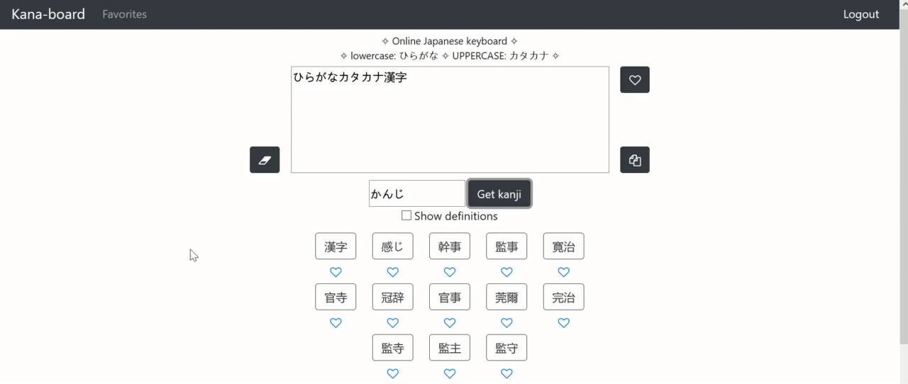

# Kana-board 

Online Japanese keyboard made with Python Flask and JS. Includes romaji to hiragana and katakana transliteration, with Kanji search using Jisho.org API.

Project for CS50.

## Demo
Working live demo: https://kanaboard.pythonanywhere.com/

## Features

### Katakana and hiragana transliteration
Type in romaji to get hiragana and katakana writings.

### Kanji search
Search the Jisho API and pick a kanji to include in your sentence.

### Save phrases

### Save kanji

## Technologies used
- Python 3.9.1
- jQuery 3.5.1
- Bootstrap 4

## Credits
- Kanji search made possible using [Jisho.org](https://jisho.org/about) API  
- This project was inspired by Lexilogos multilingual keyboard ([Japanese](https://www.lexilogos.com/keyboard/japanese.php))